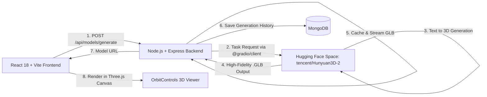

# 🚀 Text-to-3D MERN Application

A full-stack MERN application that transforms text prompts (e.g., *"a low-poly wooden chair"*) into interactive, downloadable 3D models using modern generative AI and Three.js / React Three Fiber.

---

## 🌟 Features

- **Text to 3D Generation**: Enter any descriptive text prompt and choose art styles (*Realistic*, *Low-Poly*, *Cartoon*, *Sculpture*, *PBR*).
- **Interactive 3D Viewport**: Built with **React Three Fiber (R3F)** and **Three.js**:
  - **OrbitControls**: Left-click to rotate, right-click to pan, scroll to zoom.
  - **Wireframe Mode**: Inspect underlying mesh topology.
  - **Auto-Rotate**: Showcase turntable presentation.
  - **Grid & Lighting**: Studio lighting with dynamic shadows and ground grid.
  - **Camera Reset**: Instantly restore default camera viewpoint.
- **Model Download**: One-click **Download GLB** button to save the generated 3D asset for Blender, Unity, Unreal Engine, or web projects.
- **Real-Time Progress & States**: Polling mechanism with live percentage feedback (*"Synthesizing latent geometry (25%)"*, *"Generating PBR textures (60%)"*, *"Finalizing GLB (95%)"*).
- **MongoDB History**: Automatically stores generation prompts, timestamps, task IDs, and GLB URLs in MongoDB with instant in-canvas reloading.
- **Resilient Architecture**: Graceful fallback to in-memory caching if MongoDB is temporarily unreachable during local development.
- **Production-Ready**: Configured for seamless deployment on **Vercel** (Frontend) and **Render** (Backend).

---

## 🏗️ Architecture & Tech Stack



- **Frontend**:
  - React 18
  - Three.js (`three`)
  - React Three Fiber (`@react-three/fiber`)
  - Drei (`@react-three/drei`)
  - Vite 6
  - Lucide React (Icons)
  - Pure CSS with modern responsive dark theme
- **Backend**:
  - Node.js (ES Modules)
  - Express.js
  - `@gradio/client` (Direct programmatic client for Hugging Face Spaces)
  - Axios (HTTP streaming & file caching)
  - Mongoose (MongoDB ODM)
  - CORS & Dotenv
- **AI Engine (100% Free — No Credit Card Required)**:
  - **Tencent Hunyuan3D-2.0** (`tencent/Hunyuan3D-2` on Hugging Face Spaces):
    - Advanced two-stage text-to-3D diffusion model generating structured `.glb` meshes with materials.
    - Runs directly via the public Hugging Face Spaces API.
    - Zero cost, no subscription or payment details required.
    - Optional: Add a free `HF_TOKEN` from [huggingface.co/settings/tokens](https://huggingface.co/settings/tokens) for reduced queue times.
  - Also retains optional support for `Meshy API` (`AI_PROVIDER=meshy`).

---

## 📁 Project Structure

```
text-to-3d-mern/
├── client/                     # Frontend React application
│   ├── public/                 # Static assets & favicons
│   ├── src/
│   │   ├── components/
│   │   │   ├── Navbar.jsx      # Top header with health & AI badge
│   │   │   ├── PromptForm.jsx  # Prompt input, style selector & progress bar
│   │   │   ├── ModelViewer.jsx # Three.js Canvas, OrbitControls & GLB viewer
│   │   │   ├── HistoryList.jsx # Generation history cards
│   │   │   └── InfoModal.jsx   # Interactive setup & configuration guide
│   │   ├── services/
│   │   │   └── api.js          # Backend API & polling service
│   │   ├── App.jsx             # Main layout & application state
│   │   ├── App.css             # Polished UI styles
│   │   ├── index.css           # Base typography & CSS reset
│   │   └── main.jsx            # React root mount
│   ├── .env.example            # Frontend environment variables template
│   ├── package.json
│   ├── vercel.json             # Vercel SPA routing configuration
│   └── vite.config.js
│
├── server/                     # Backend Node.js / Express application
│   ├── src/
│   │   ├── config/
│   │   │   └── db.js           # Mongoose connection with graceful fallback
│   │   ├── controllers/
│   │   │   └── modelController.js # Generate, status, history, download proxy
│   │   ├── models/
│   │   │   └── Model3D.js      # Mongoose 3D generation schema
│   │   ├── routes/
│   │   │   └── modelRoutes.js  # Express REST API routes
│   │   ├── services/
│   │   │   └── aiService.js    # AI Text-to-3D service (Meshy v2 API)
│   │   └── server.js           # Express app entrypoint & CORS setup
│   ├── .env.example            # Backend environment variables template
│   ├── package.json
│   └── render.yaml             # Render deployment configuration
│
├── package.json                # Root workspace convenience scripts
└── README.md                   # Complete documentation
```


---

## 🎮 How to Use the Application

1. **Enter a prompt**:
   - Type your prompt in the text area (e.g. *"a low-poly wooden chair with cushions"*), or click one of the quick suggestion chips.
2. **Choose Art Style**:
   - Select *Realistic*, *Low-Poly*, *Cartoon*, *Sculpture*, or *PBR*.
3. **Click "Generate 3D Model"**:
   - The backend creates a task via the AI API.
   - The UI shows live progress updates and status descriptions.
4. **Inspect in 3D**:
   - When generation finishes, the GLB model automatically loads in the interactive 3D viewport.
   - **Rotate**: Left-click and drag.
   - **Pan**: Right-click and drag.
   - **Zoom**: Mouse scroll wheel.
   - **Wireframe Mode**: Click **Wireframe** on the top toolbar to inspect mesh triangles.
   - **Reset**: Click **Reset** to return to the original camera angle.
5. **Download Model**:
   - Click the green **Download GLB** button in the viewport toolbar to download the generated `.glb` asset.
6. **History**:
   - Previous generations appear in the **Generation History** list on the bottom left. Click any completed model to immediately reload it in the 3D viewport.

